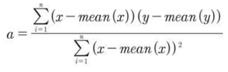
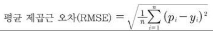
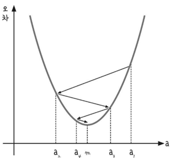
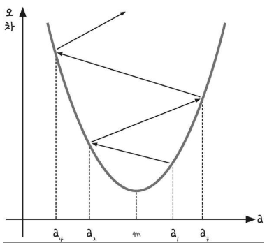
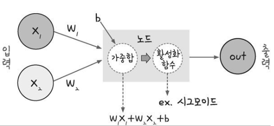
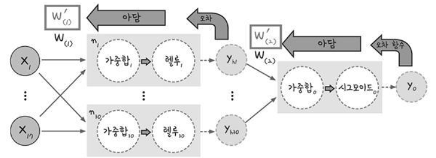

# Tensorflow

> 텐서플로우는 뭐다

텐서플로우에서 계산을 수행할 때에는 `상수 정의 > 계산 정의 > 세션 시작` 의 순서로 진행한다.

```python
#상수 정의
a = tf.constant(1234)
b = tf.constant(5000)

#계산 정의
add_op = a+b

#세션 시작
sess = tf.Session()
res = sess.run(add_op)
print(res)

Out: 6234
```


## Tensor Board

> 텐서보드는 데이터의 흐름을 시각화하는 도구이다.

```python
sess = tf.Session()
tw = tf.summary.Filewriter("log_dir", graph = sess.graph)
```

```bash
tensorboard --logdir=log_dir
```

브라우저에서 "Localhost:6006"를 호출하여 텐서보드의 시각화 결과를 확인할 수 있다.


## 최소제곱법

> 일차 함수(회귀 모델)의 기울기 a와 y 절편 b를 구할 수 있다.
>
> 회귀분석에서 사용되는 표준 계산 방식이다.

- 기울기 a



- y 절편 b
  - b = mean(y) - (mean(x) * a)


## 평균 제곱근 오차

> 오차 = 실제 값 - 예측값
>
> 평균 제곱근 오차(Root Mean Squared Error)



## 경사하강법

> 반복적으로 기울기 a를 변화시켜서 m값을 찾아내는 방법
>
> == 미분값이 0인 지점을 찾는 방법 중 하나이다.



- 기울기의 부호를 바꿔 이동시킬 때 적절한 거리를 찾지 못해 너무 멀리 이동시키면 a의 값이 한 점으로 모이는 것이 아니라 위로 치솟아 버린다.
  - 이동거리를 정해주는 것이 `학습률(learning rate)`이다.
  - 따라서 학습률을 적절히 바꾸면서 최적의 학습률을 찾는 것이 딥러닝에서 중요한 최적화 과정이다.



- 케라스는 학습률을 자동으로 조절해준다.


## 퍼셉트론

> 랄랄라



- 오차 역전파

  - 다층 퍼셉트론의 최적화 과정이다
  - 오차가 최솟값에 도달할 때까지 가중치 수정 작업을 반복하는 것
    - 출력층으로부터 하나씩 앞으로 되돌아가며 각 층의 가중치를 수정한다.

  

